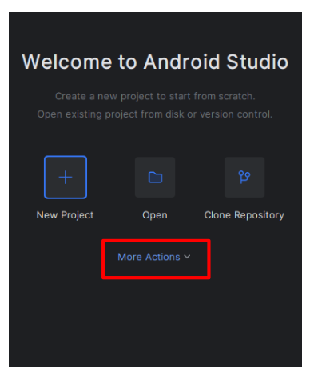
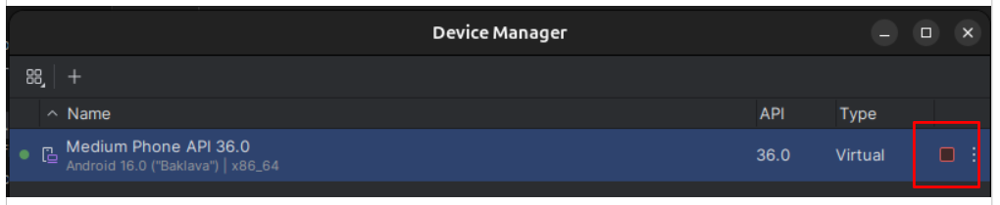

# Installation documentation
___

<p>This installation documentation does not cover the installation of nodejs and npm, install them prior to this.</p>

1. Uninstall old installation of react-native-cli:
```shell
    npm uninstall -g react-native-cli
```
2. Initialize new project if not done from repo:
```shell
    npx react-native init Fansy
```
3. Install Android Studio:
```shell
    snap install android-studio --classic
```
4. Store install directory to `local.properties`:
```shell
    echo "sdk.dir=$HOME/Android/Sdk" > android/local.properties
```
also to .bashrc:
```shell
    export ANDROID_HOME=$HOME/Android/Sdk
    export PATH=$PATH:$ANDROID_HOME/emulator
    export PATH=$PATH:$ANDROID_HOME/tools
    export PATH=$PATH:$ANDROID_HOME/tools/bin
    export PATH=$PATH:$ANDROID_HOME/platform-tools
```
5. Start Android Studio and choose the emulator phone:



6. Start one Terminal with:
```shell
    npx react-native start
```
7. Start the other Terminal with:
```shell
    npx react-native run-android
```
